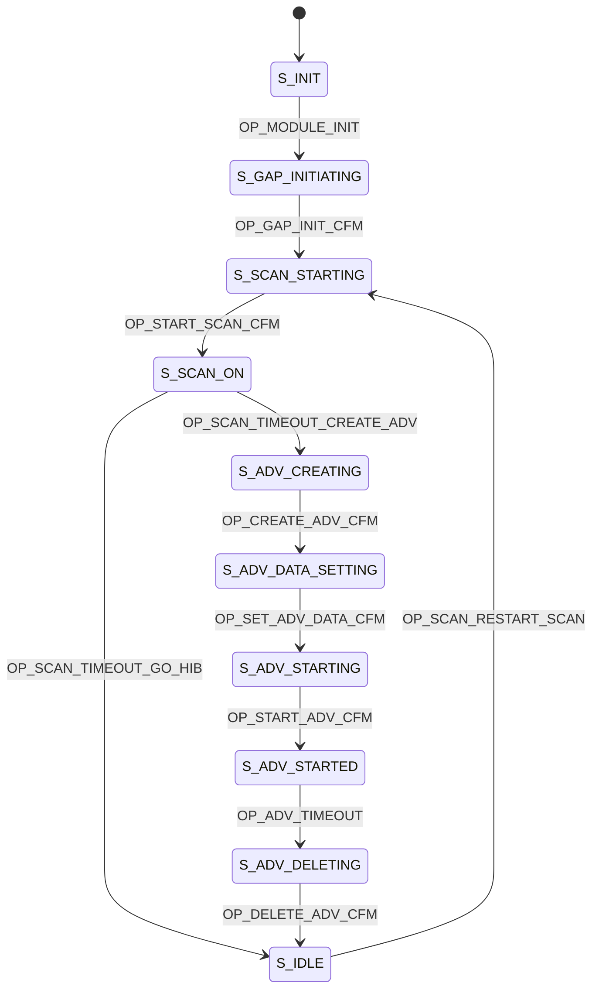

# LunchTrak Peripheral

The peripheral scanner works along with the main LunchTrak Scanner to help make check-in as reliable as possible. There are two different settings: extender and calibrator mode.

## Extender Mode

The extension scanner will detect BLE packets and report the ones with highest RSSI to the main scanner. The purpose of this scanner is to prevent situations where the student's body blocks the BLE packets from reaching the main scanner. They should be placed directly across the main scanner.

## Calibrator Mode

The calibrator scanner is needed because of how unreliable RSSI can be for detecting proximity. This scanner will continously report the maximum average RSSI that it detects for each beacon to the main scanner. The scanner will then know to check in a student when they hit this new RSSI threshold (with a small buffer).

This scanner needs to come before the main scanner in line.

## State Machine

# Notes and TODOs

## TODO:

- Extender and calibrator mode + testing for accuracy improvements
- Document adv packet 

Calibrator
Listen and store max rssi for all devices
And the adv step, select top 3 who exceed their current high